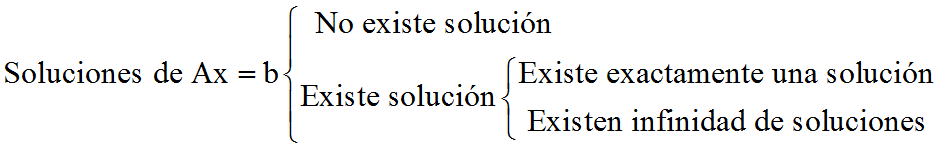

# Capítulo 1: Ecuaciones lineales y matrices
## 1.1 Sistemas lineales
Una ecuación lineal es una ecuación del tipo ax=b que expresa a b en términos de la variable x y la constante a.

En forma general se define de la siguiente manera:
$a_1x_1 + a_2x_2 + ... +a_nx_n= b$

Siendo $x_1, x_2,...,x_n$ variables y $a_1,a_2,...,a_n$ y $b$ constantes reales.
Una ecuación lineal:
- No comprende producto de variables.
- Todas las variables deben estar a la primera potencia.
- Los coeficientes son constantes.

Ejemplos:
  - $6x + 2y = 10$
  - $u + v + w +2 = 0$

Una solución de una ecuación lineal es una sucesión de números $s_1,s_2,...,s_n$.
El conjunto de todas las soluciones es el **conjunto solución**
___
### Sistemas de ecuaciones lineales
Un conjunto de ecuaciones lineales en las variables - $x_1,x_2,...,x_n$ es un **sistema de ecuaciones lineales**

Una sucesión de números $s_1,s_2,...,s_n$ es una solución del sistema si
$x_1 = s_1,x_2 = s_2,...,x_n = s_n$

Para encontrar las soluciones de un sistema lineal se puede usar el **método de eliminación**, que consiste en repetir las siguientes **operaciones elementales**:
- Multiplicar una ecuación por un escalar (distinto de cero).
- Sumar o restar una ecuación con otra.
- Intercambiar dos ecuaciones.

Ejemplo: 

Las graficas de cada una de las ecuaciones de un sistema con dos incógnitas:

Ecuaciones lineales-2.png)

*(para 3 variables pasa algo muy similar pero con graficaos en 3 dimensiones)*
___
## 1.2 Matrices
Una **matriz** de $m*n$ es un arreglo rectangular de números ordenados en **m filas** y **n columnas**.

_Las matrices de 1xn o mx1 se llaman **n-vectores**_.

Si $A$ es una matriz de mxn...

$a_{ij} =$ el elemento que esta en la fila $i$ y en la columna $j$ de $A$.
La **i-ésima** fila de $A$ es: $[a_{i1},a_{i2},...,a_{in}]$

la **j-ésima**columna de $A$ es:  $[a_{1j},a_{2j},...,a_{mj}]$
___
### Matriz diagonal
Es una matriz **cuadrada** $A$ en donde cada termino fuera de la diagonal principal es $0$, es decir:

$a_{ij} = 0$ para $i$ ≠ $j$
___
### Matriz escalar
Es una matriz diagonal en donde los términos de la diagonal son iguales:

$a_{ij} = 0$ para $i$ ≠ $j$

$a_{ij} = c$ para $i=j$

___
### Definición: 
Dos matrices de mxn $A$ y $B$ **son iguales** si $a_{ij} = b_{ij}$

___
### Suma de matrices:
Si $A$ y $B$ son matrices de mxn, $C = A+B$ es de mxn definida por:

$c_{ij} = a_{ij}+b_{ij}$

___

### Multiplicación Escalar
Si $A$ es de mxn y $r$ es un numero real, el producto $rA$ es la matriz $B$ de mxn, donde
$b_{ij} = ra_{ij}$

$B$ se obtiene multiplicando cada elemento de $A$ por $r$.

si $A_1,A_2,...,A_k$ son matrices de mxn y $c_1, c_2,...,c_k$ son números reales, entonces:

$c_1A_1+c_2A_2+...+c_kA_k$

Se denomina combinación lineal de $A_1,A_2,...,A_k$ y $c_1, c_2,...,c_k$ son los coeficientes.

___
### La transpuesta de una matriz
Si $A$ es una matriz de mxn, la matriz $A^T$ de nxm, donde:

$a^T_{ij} = a_{ji}$

es  la transpuesta de $A$.
___
### Producto punto

El **producto punto** o **producto interior** de dos vectores en $R^n$

$a = [a_1,a_2,...,a_n]$

$b = [b_1,b_2,...,b_n]$

$a.b = a_1b_1+a_2b_2+...+a_nb_n$

___
### Multiplicación de matrices
si $A$ es una matriz de mxp y $B$ es una matriz de pxn, entonces el producto de $A$ y $B$, se denota por $AB$, es la matriz $C$ de mxn, definida por:

$c_{ij} = a_{i1}b_{1j}+a_{i2}b_{2j}+...+a_{ip}b_{pj}$

___
### Sistemas Lineales

$Ax = b$

$A$ es la matriz de los coeficientes del sistema de mxn.

$x$ es vector de las incognitos de longitud $n$.

$b$ es el vector que contiene los lados derechos de las ecuaciones lineales.

___
## 1.4 Propiedades de las operaciones con matrices

### Teorema 1.1 

Propiedades de la suma de las matrices.

Sean $A$,$B$,$C$ y $D$ matrices de mxn, entonces:
1. $A+B = B+A$, Propiedad conmutativa
2. $A+(B+C) = (A+B)+C$, Propiedad asociativa.
3. Existe una única matriz para cualquier $A$, tal que: $A+O = O+A = A$, Elemento neutro
4. Existe una única matriz $D$ para cada $A$, tal que:  $A+D = D+A = O$, Inverso aditivo o negativo de $A$, $D=-A$
___
### Teorema 1.2
_Propiedades de la multiplicación de matrices._

Si $A$,$B$ y $C$ son matrices con tamaños adecuados, entonces:
1. $A(BC) = (AB)C$
2. $A(B+C) = AB + AC$
3. $(A+B)C = AC + BC$

La matriz escalar de nxn con los valores de la diagonal iguales a 1 es la **matriz identidad de orden n**, denotada como: $I_n$

Si $A$ es una matriz de mxn, entonces $AI_n = I_mA = A$

___
### Teorema 1.4
Propiedades de la transpuesta

Si $r$ es un escalar y $A$ y $B$ son matrices, entonces

1. $(A^T)^T = A$
2. $(A+B)^T = A^T+B^T$
3. $(AB)^T = B^TA^T$
4. $(rA)^T = rA^T$

___
Una matriz $A$ es **simétrica** si $A^T = A$
___
## 1.6 Soluciones de sistemas de ecuaciones lineales.

### Matriz escalonada
$A$ de mxn es __escalonada reducida por filas__ si satisface las siguientes propiedades:
1. La primera entrada ≠ 0 de la fila es un 1(__pivote__).
2. Si un afila no es cero su pivote aparece debajo y a la derecha de los pivotes de las filas anteriores.
3. Las filas que consten de solo ceros están en la parte inferior de la matriz.
4. Si una columna tiene un pivote el resto de las entradas son 0.

*Una matriz $A$ de mxn que satisface las propiedades 1, 2 y 3 esta en la forma __escalonada por filas__.*

___
### Operaciones elementales por filas

1. Multiplicar la fila $r$ por un escalar $c$ distinto de cero.
2. Sumar algebraicamente una fila con otra.
3. Intercambiar las filas $r$ y $s$ de $A$.

_Una matriz $A$ es equivalente por filas a $B$, si $B$ se puede obtener aplicando un numero finito de operaciones elementales por fila sobre $A$._
___
### Teorema 1.5
Toda matriz de mxn es equivalente por filas a una matriz en forma escalonada por fila.

### Teorema 1.6
Toda matriz de mxn, es equivalente por filas a una única matriz en forma escalonada reducida por filas.
___

### Resolución de sistemas lineales
Para hallar la solución de un sistema $Ax =b$, se debe manipular la matriz aumentada hasta llegar a una forma de la cual puedan deducirse fácilmente las soluciones.

___
### Teorema 1.7
Sean $Ax = b$ y $Cx = d$ sistemas lineales, con $m$ ecuaciones y $n$ incógnitas. si las matrices $[Ab]$ y $[Cd]$ de estos sistemas son equivalentes por filas, ambos sistemas tienen exactamente las mismas soluciones.
___
### Eliminación de Gauss para $Ax =b$

1. Formar la matriz aumentada $[Ab]$.
2. Llevar la matriz aumentada a una forma escalonada por filas
3. Resolver el sistema lineal correspondiente por medio de **sustitución hacia atras o regresiva**
___

### Conjunto de soluciones

 
 Si no hay soluciones el sistema es __incompatible__.
 
 Si hay solo una solución el sistema es __compatible determinado__.
 
 Si hay infinitas soluciones el sistema es __compatible indeterminado__
 
___
### Sistemas Homogéneos

Un sistema lineal de forma $Ax = 0$ es un sistema __homogéneo__.

Un sistema homogéneo siempre tiene solución, ya que $x_1 = 0,x_2 = 0,...,x_n = 0$, siempre lo satisface. Esta se conoce como __solución trivial__.

Aunque puede no ser la única. Una solución donde todas las $x_i$ se anulen, es una __solución no trivial__.

Las alternativas son:
1. Tiene solo la solución trivial.
2. Posee infinitas soluciones no triviales además de la trivial.
___
### Teorema 1.8
El sistema homogéneo  tiene solución no trivial si el número de incognitas es mayor al numero de ecuaciones.

o de forma equivalente:
Si $A$ es de mxn y $Ax = 0$ solo tiene solución trivial entonces $m >= n$

## 1.7 La inversa de una matriz

Una matriz es __no singular__ o invertible si existe una matriz $B$ de nxn tal que:

$AB = BA = I_n$

La matriz $B$ es la __inversa__ de $A$, Si no existe la matriz $B$, entonces $A$ es __singular__ (no invertible).

### Teorema 1.9
Si una matriz tiene inversa, entonces la inversa es única.

La demostración se basa solamente en la propiedad asociativa del producto.

___
### Teorema 1.10
1. Si una matriz $A$ no es singular: $(A^T)^{-1} = (A^{-1})^T$
2. Si $A$ no es singular, $A^{-1}$ tampoco lo es y: $(A^{-1})^{-1} = A$
3. Si $A$ y $B$ no son singulares, entonces $AB$ es no singular y: $(AB)^{-1} = B^{-1}A^{-1}$
___
### Método práctico para determinar $A^{-1}$
1. Formar la matriz $[AI_n]$
2. Transformar la matriz aumentada a su forma escalonada reducida por filas.
3. Suponga que el paso dos ha producido una matriz escalonada reducida por filas $[C D]$.
    - Si $C = I_n$ entonces $D = A^{-1}$
    - si no, $A$ es singular y $A^{-1}$ no existe.

_Si la matriz escalonada tiene una fila de ceros entonces $A$ es singular y $A^{-1}$ no existe_

___
### Teorema 1.12
Una matriz de nxn no es singular si y solo si es equivalente por filas a $I_n$

___
### Sistemas lineales e inversas
Sea $Ax=b$ un sistema de nxn. Si $A^{-1}$ existe.

$A^{-1}(Ax) = A^{-1}b$

$(A^{-1}A)x =A^{-1}b$

$I_nx =A^{-1}b$

$x =A^{-1}b$

Si $A$ es __no signular__ tenemos __solución única__.

___

### Teorema 1.13

Si $A$ es una matriz de nxn, el sistema hoogéneo $Ax = 0$ tiene una solución __no trivial__ solo si $A$ es singular.
___
### Teorema 1.14
Si $A$ es una matriz de nxn, entonces $A$ es no signular si y solo si el sistema lineal $Ax = b$ tiene solución unica para cada $b$.
___
### Lista de equivalencias no singulares
Las siguientes afirmaciones son equivalentes.
1. $A$ es no singular.
2. $A$ es equivalente por filas a I_n
3. $Ax = 0$ solo tienesolución trivial.
4. $Ax = b$ tiene solución unica para cada $b$.

___
## 1.8 Factorización LU

Una matriz $A$ de mxn se puede escribir como el producto de una matriz $L$ triangular Inferior y una matriz $U$ escalonada (triangular superior), es decir:

$A = LU$

Donde $L$ es de mxm y $U$ es de mxn.

Decimos que $A$ tiene una __factorización LU__ o una __descomposición LU__.

La factorización LU permite resolver de manera eficiente un sistema lineal $Ax = b$

_Sustituimos $A$ por $LU$..._

 $Ax = b$
 
 $(LU)x = b$
 
 $L(Ux) = b$
 
 2. Si $Ux = z$...

$Lz = b$

_Obtenemos los sistemas triangulares..._

$Ax = b$ → $Lz = b$ y $Ux = z$

_Ahora podemos resolver un sistema $Ax = b$ de la siguiente manera:_

$A = LU$

1. $Lz = b$, Obtenemos $z$
2. $Ux = z$, Obtenemos $x$

Se puede resolver mediante una sustitución hacia adelante en $Lz = b$ y una sustitución regresiva en $Ux = z$.

El procedimiento para obtener la factorización LU de una matriz $A$ es el siguiente:

- Obtener la matriz escalonada usando solamente la operacion de sumar un multiplico de una fila a otra guardando los __multiplicadores__ durante el proceso de eliminación.
- Construír la matriz $L$ a partir de una $I_m$ Colocando los multiplicadores __cambiados de signo__ en la posición correspondiente.