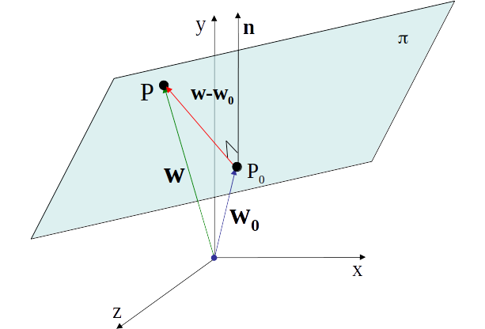

# Capítulo 5: Aplicaciones de vectores en $R^2$ y $R^3$
## 5.2 Rectas y planos
### Rectas en $R^2$
Dos puntos distintos cualesquiera $P_1(x_1,y_1)$ y$P_2(x_2,y_2)$ en $R^2$ determinan una linea recta cuya ecuación es
$$
ax + by + c = 0
$$
donde $a$, $b$ y $c$ son reales, y $a$ y $b$ no simultaneamente cero.
Esta se denomina **ecuación cartesiana** de la recta.

Todo punto  $P(x,y)$ que satisface la ecuación pertenece a la recta y viceversa.

Como $P_1(x_1,y_1)$ y$P_2(x_2,y_2)$ pertenecen a la recta, satisfacen
$$
\begin{cases} 
  ax_1+by_1 +c = 0\\
   ax_1+by_1 +c = 0
\end{cases}
$$
Los valores de $a$, $b$ y $c$ se obtienen resolviendo el sistema homogeneo. La ecuación cartesiana se obtiene dandole un valor particular a la variable libre c.
### Rectas en $R^3$
Una recta queda determinada si se especifican su dirección y un punto. Sea $\vec u = (a,b,c)$ un vector no nulo en $R^3$, y sea $P_0(x_0,y_0,z_0)$ un punto en $R^3$. Sea $\vec w_0$ el vector asociado al punto $P_0$ y $\vec x$ el vector asociado a un punto cualquiera de la recta $P(x,y,z)$. La recta $L$ que pasa por el punto $P_0$ y es paralela a $u$ consta de los puntos $P(x,y,z)$ tales que:
$$
\vec x = \vec w_0 +t\vec u
$$
La ecuación anterior se denomina **ecuacion paramétrica** o **vectorial** de la recta $L$. Puede escribirse en termino de sus componentes, como
$$
\begin{cases} 
  x = x_0 +ta\\
  y = y_0 +tb & -\infty < t < +\infty \\
  z = z_0 +tc 
\end{cases}
$$
que son las **ecuaciones paramétricas** de la recta $L$.

Podemos despejar $t$ de cada ecuación e igualar.
Obtenermos las ecuaciones en **forma simetrica** de la recta.
$$
\frac {x-x_0}{a} =\frac {y-y_0}{b} =\frac {z-z_0}{c} 
$$

### Planos en $R^3$
Un plano en $R^3$ queda determinado especificando tres de sus puntos no alineados.\
La ecuación cartesiana de un plano en $R^3$ esta dada por
$$
ax+by+cz+d =0
$$

Si, $P_1$,$P_2$ y $P_3$ son puntos del plano, deben satisfacer la ecuación anterior, es decir
$$
\begin{cases} 
 ax_1+by_1+cz_1+d = 0\\
 ax_2+by_2+cz_2+d = 0\\
 ax_3+by_3+cz_3+d = 0
\end{cases}
$$
Un plano en $R^3$ puede determinarse tambien especificando un **punto** del plano y un **vector** perpendicular al mismo.
Sean $P_0(x_0,y_0,z_0)$ y $P(x,y,z)$ puntos el plano y $\vec w$ y $\vec w_0$ sus vectores asociados, y sea $\vec n = (a,b,c)$ un vector distinto de cero normal al plano. El vector $P_0P = \vec w -\vec w_0$ es un vector del plano y por lo tanto perpendicular a $\vec n$

Si el vector $\vec w-\vec w_0$ es perpendicular a $\vec n$ entonces:
$$
\vec n.\vec{P_0P} = \vec n-.(\vec w -\vec w_0) = 0 = a(x-x_0)+b(y-y_0)+c(z-z_0)
$$
distribuyendo
$$
ax+by+cz-(ax_0+by_0+cz_0) = 0
$$
### Posiciones relativas de rectas y planos
Dos planos $\pi_1$ y $\pi_2$ en $R^3$ son paralelos o se intersecan en una linea recta.

1. Son paralelos si sus vectores normales son paralelos.\
Sean $\vec n_1$ el vector normal al plano $\pi_1$ y $\vec n_2$ el vector normal al plano $\pi_2$, entonces son paralelos si
$$
\vec n_2 = \alpha\vec n_1, \alpha \in R
$$
2. Para determinar la recta intersección de los planos $\pi_1$ y $\pi_2$, resolvemos el sistema formado por sus ecuaciones cartesianas. La solución sera la ecuación parametrica(vectorial) de la recta.

Las ecuaciones en forma simetrica, de una recta pueden utilizarse para determinar los dos planos cuya intersección es la recta dada.
$$
\frac {x-x_0}{a} =\frac {y-y_0}{b} =\frac {z-z_0}{c} 
$$

La recta es la intersección de los planos
$$
\frac {x-x_0}{a} =\frac {y-y_0}{b}
\text { y }
\frac {x-x_0}{a} =\frac {z-z_0}{c} 
$$
cuyas ecuaciones cartesianas son
$$
\pi_1 : bx -ay-bx_0+ay_0 = 0
$$
$$
\pi_2 : cx -az-cx_0+az_0 = 0
$$

Tres planos en $R^3$ pueden intersecarse en un plano, una recta o un punto. La forma de la solucion del sistema formado por sus ecuaciones cartesianas dira de que manera se intersecan.